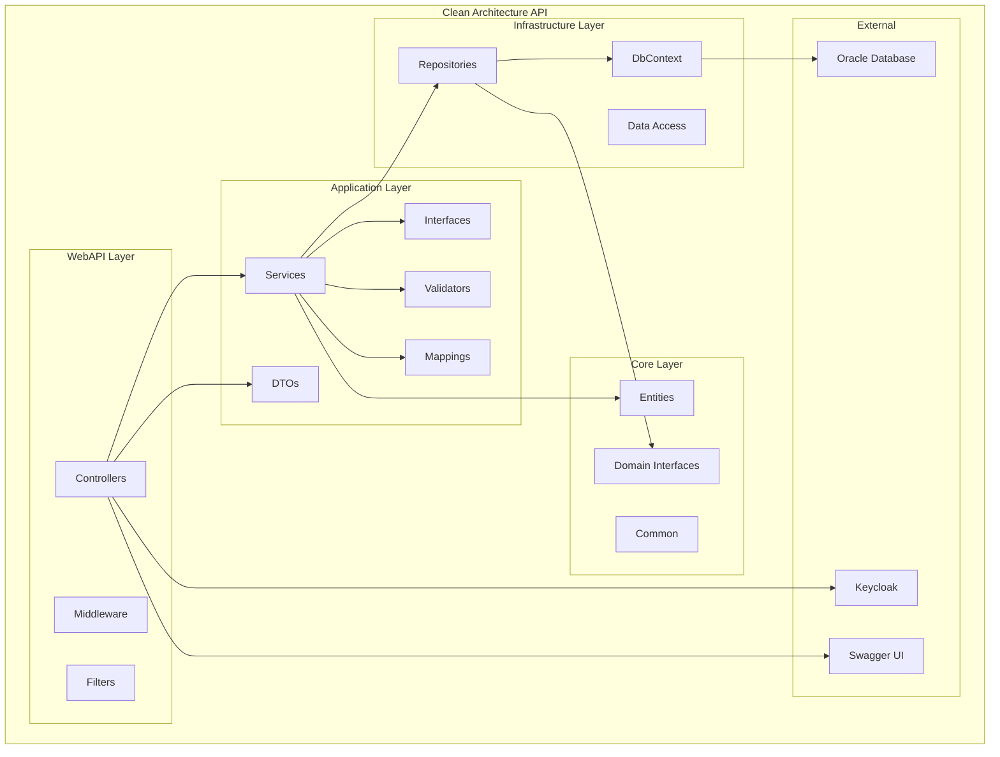
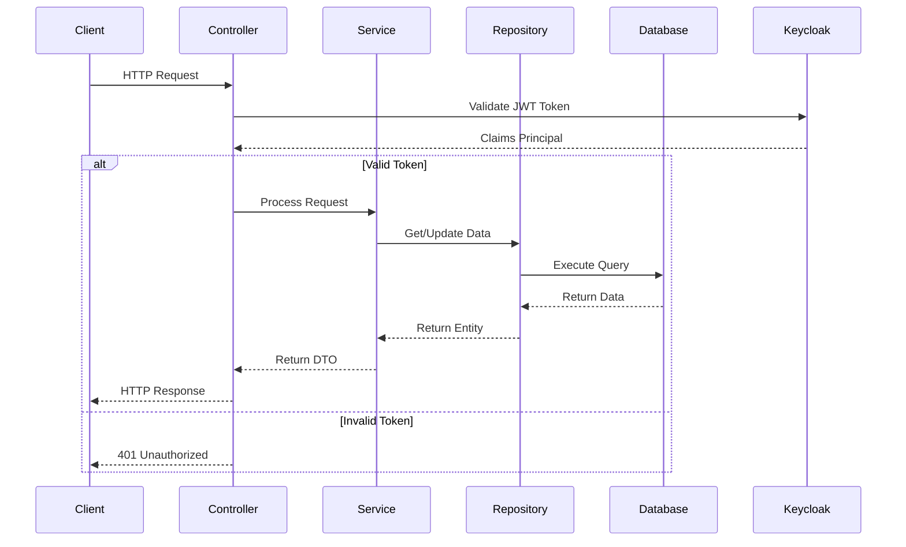
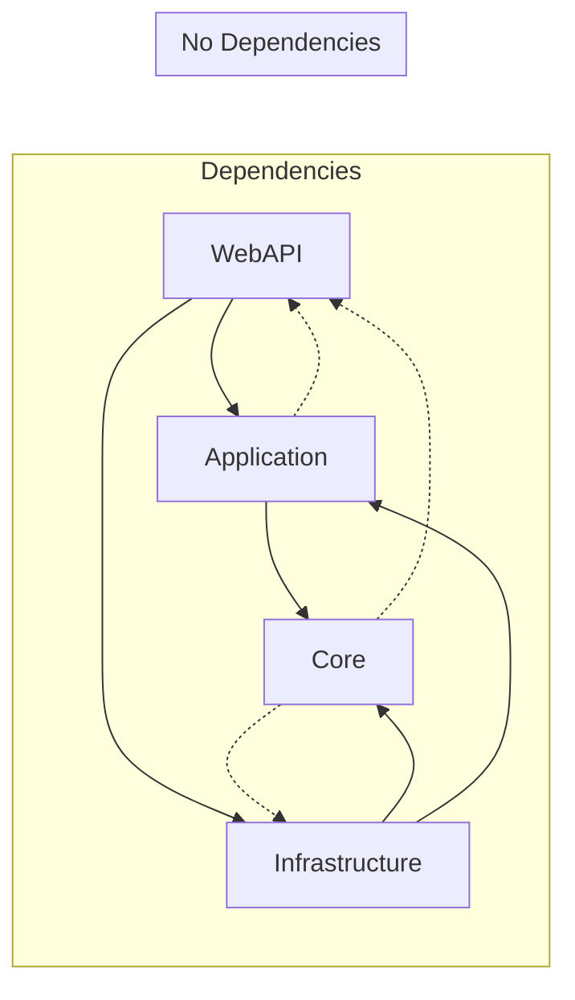
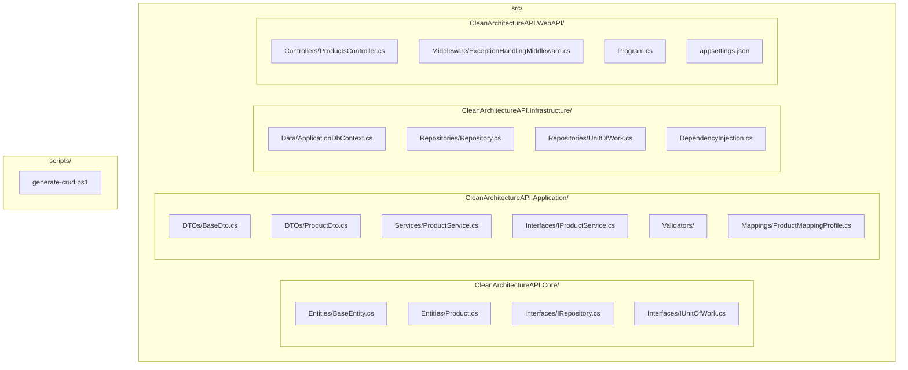
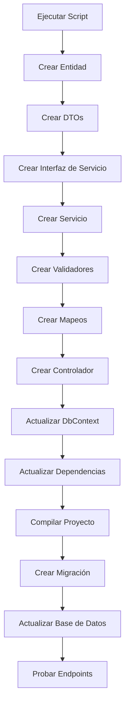
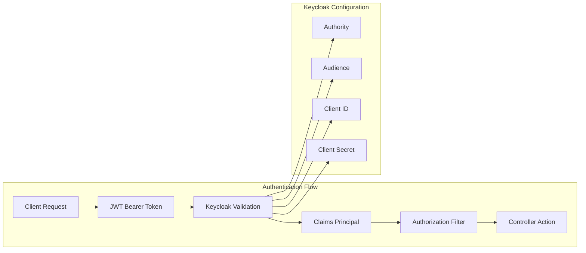
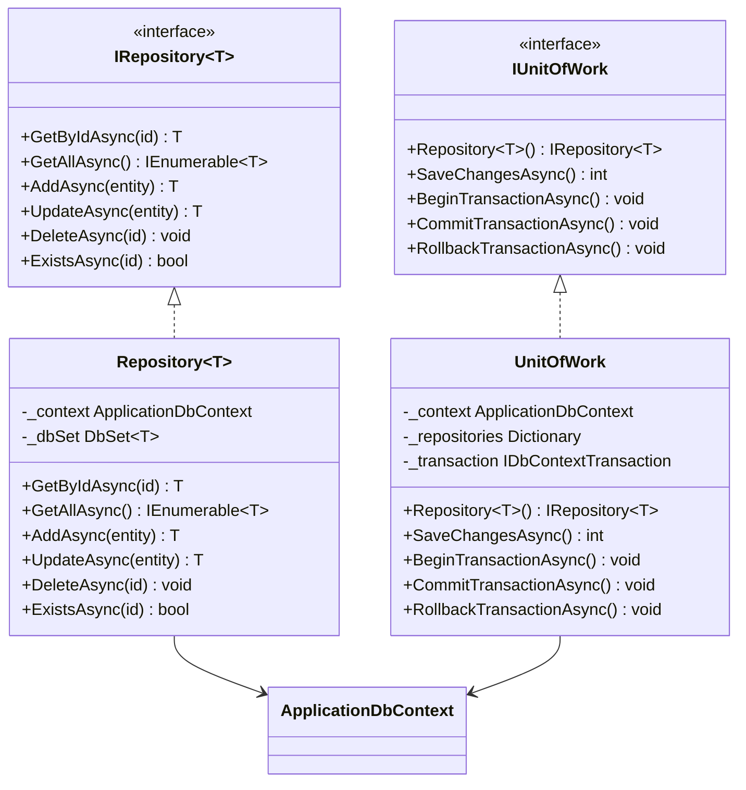
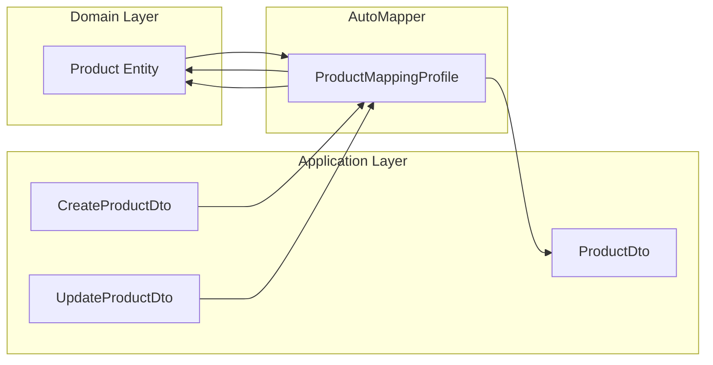
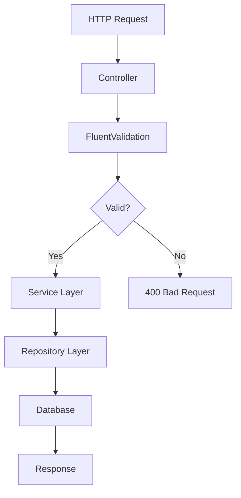
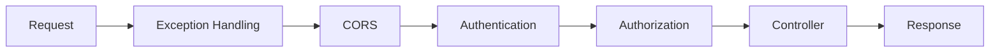

# Diagrama de Arquitectura

## Estructura de Proyectos

## Flujo de Datos

## Dependencias entre Capas

## Estructura de Carpetas Detallada

## Flujo de Scaffolding Automático

## Configuración de Autenticación

## Patrón Repository

## Mapeo de Entidades a DTOs

## Validación de Datos

## Middleware Pipeline

